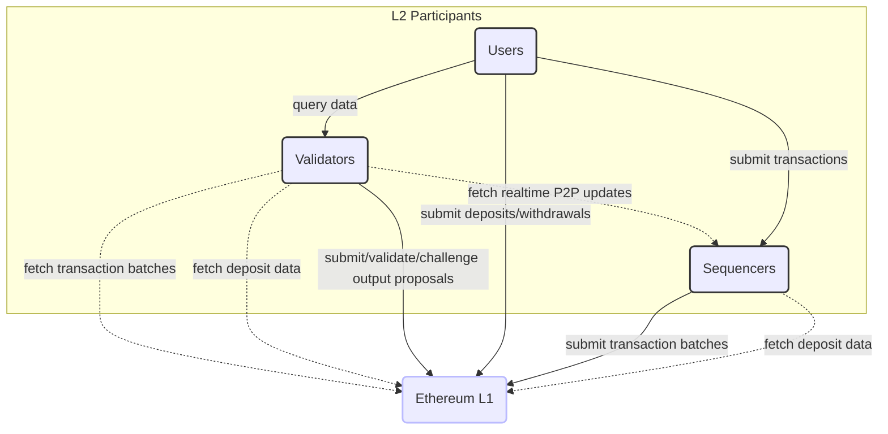
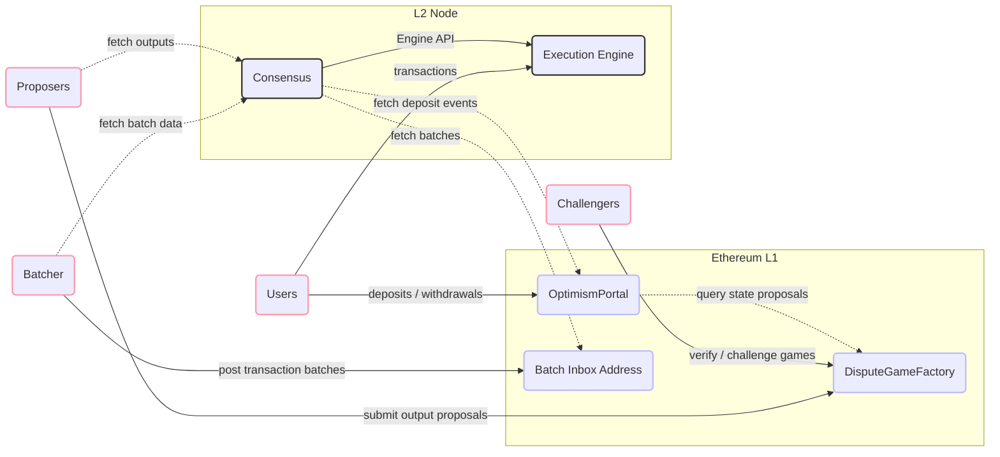
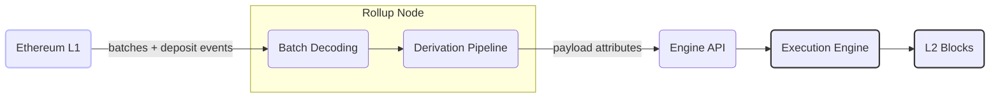
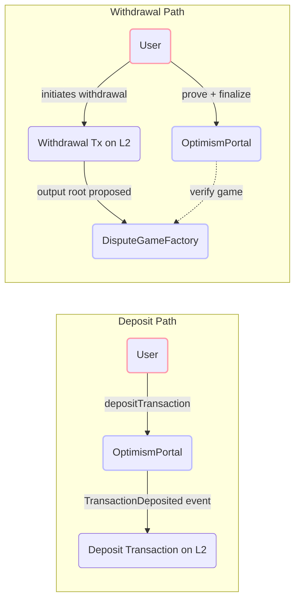
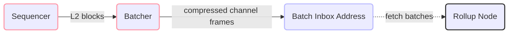
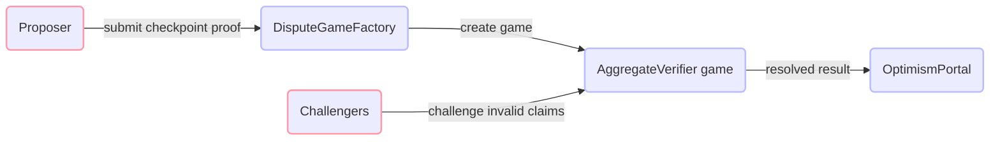
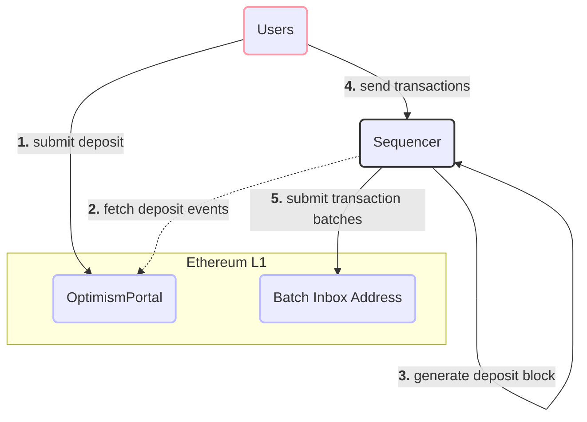
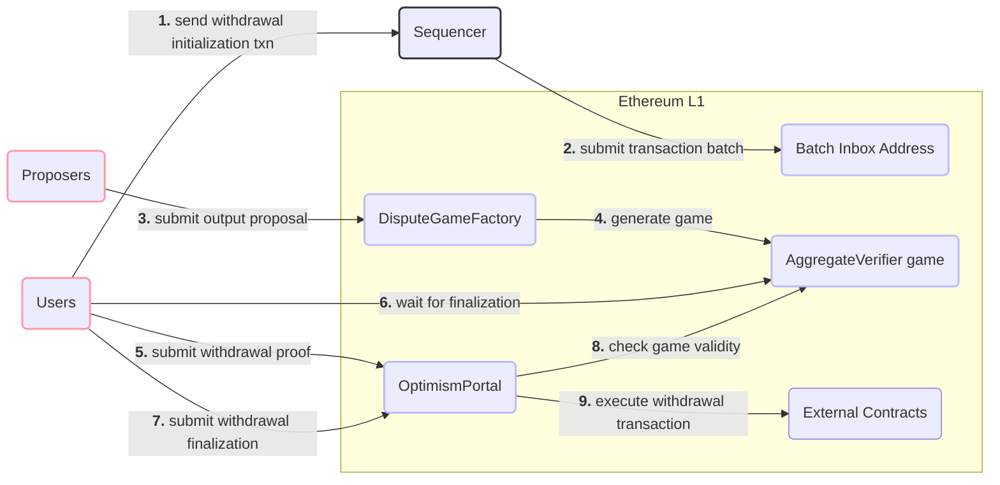

Base is an Ethereum rollup: L2 transaction data is published to Ethereum so anyone can reconstruct the chain, and proofs let any participant challenge an invalid state transition. This page walks through the protocol-level pieces and the user flows that tie L1 and L2 together. For the codebase-level view of how these subsystems map to Rust crates, see [Architecture Overview](/architecture/overview/).

## Network Participants

Three kinds of actors interact with Base: users, sequencers, and validators.

### Users

Users are the broad set of participants who send transactions — either through the sequencer or by calling contracts directly on Ethereum — and who read transaction data back from the interfaces that validators expose.

### Sequencers

The sequencer is Base's block producer. The network runs a single active sequencer today, and it:

- Accepts transactions directly from Users.
- Observes "deposit" transactions generated on Ethereum.
- Consolidates both transaction streams into ordered L2 blocks.
- Submits information to L1 that is sufficient to fully reproduce those L2 blocks.
- Provides real-time access to pending L2 blocks that have not yet been confirmed on L1.
- Produces Flashblocks every 200ms, committing to the ordering of transactions within the block as it is being built.

Although it is central to how the chain runs, the sequencer is not a trusted party. Its job is to improve the experience — ordering transactions far faster and more cheaply than would be possible if every user submitted directly to L1 — not to be relied upon for correctness.

### Validators

Validators run the L2 state transition function for themselves, independently of the sequencer. By doing so they keep the network honest and serve chain data back to users. In general they:

- Sync rollup data from L1 and the Sequencer.
- Use rollup data to execute the L2 state transition function.
- Serve rollup data and computed L2 state information to Users.

A validator can additionally take on the Proposer and/or Challenger role, which means it will:

- Submit assertions about the state of the L2 to a smart contract on L1.
- Validate assertions made by other participants.
- Dispute invalid assertions made by other participants.

## High-Level System Diagram

The diagram below traces how the main components talk to each other across L1 and L2.

## Protocol Components

### Consensus

The consensus layer derives the canonical L2 chain from L1 data. It pulls transaction batches out of the Batch Inbox and deposit events out of `OptimismPortal`, assembles payload attributes from them, and drives the execution engine through the Engine API. Newly built but still-unconfirmed blocks are gossiped to peers over a dedicated P2P network, so validators see them with low latency well before the corresponding batches reach L1.

### Execution

Execution runs on a Reth-based engine that speaks the standard Ethereum JSON-RPC API and processes the blocks consensus hands it. Predeploys (system contracts living at fixed L2 addresses), precompiles, and preinstalls extend the EVM with the rollup-specific behavior it needs — fee distribution, L1 block attribute injection, and cross-domain messaging among them.

### Bridging

Deposits move from the `OptimismPortal` contract on L1 into L2 as special deposit transactions placed at the top of each L2 block. Withdrawals run the other way: a user starts a withdrawal transaction on L2, a proposer files an output root with `DisputeGameFactory`, and once the challenge period elapses the user proves and finalizes the withdrawal back on L1 through `OptimismPortal`.

### Batcher

The batcher is a sequencer-operated service that compresses L2 transaction data into channel frames and posts them — as calldata or blobs — to the Batch Inbox Address on L1. This is the data availability layer: with it, any validator can rebuild the full L2 chain from L1 alone.

### Proofs

Output proposals and the proofs behind them are what make the L2 state verifiable. A proposer opens a checkpoint game through `DisputeGameFactory`, the onchain verifier contracts check the proof material, and challengers can dispute any claim they believe is wrong. A withdrawal can only be finalized through `OptimismPortal` after the game backing it resolves in the proposer's favor. The current proof topology is the Azul multiproof design — see [Azul Proof System](/specifications/azul-proofs/) for the dispute-game and finality details.

## Core User Flows

### Depositing ETH to Base

Most users arrive on L2 by bridging ETH over from L1; once they hold ETH for fees, they begin transacting on Base. The flow below shows that first hop and the components it touches.

### Sending Transactions on Base

Transacting on Base is identical to transacting on Ethereum: a user signs a transaction and submits it via `eth_sendRawTransaction` to any node's JSON-RPC endpoint. The sequencer takes it from the mempool, slots it into an L2 block, and eventually posts the containing batch to L1.

### Withdrawing from Base

Moving ETH or ERC-20 tokens from Base back to Ethereum starts as an ordinary L2 transaction but finishes with transactions on L1. A withdrawal has to reference a valid proof game that asserts the L2 state at a particular point, and only completes once that game has finalized.

