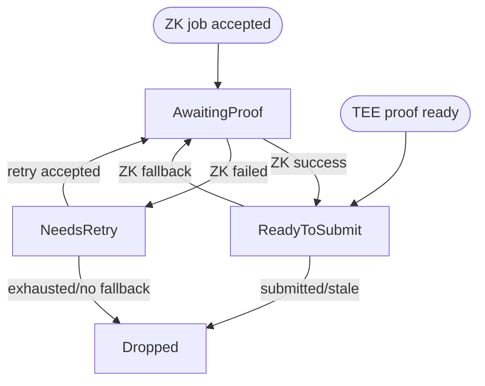

The challenger guards the proof system by independently checking in-progress `AggregateVerifier` games against canonical L2 state. When it finds a checkpoint root that does not match, it obtains the proof material the game contract demands and sends a dispute transaction on L1.

The ZK path of the challenger is permissionless — anyone with L1 and L2 RPC access, a ZK proving service, and an L1 transaction signer can run one. Base may additionally run a challenger that has access to a TEE proof endpoint so invalid TEE-backed games can be nullified on the faster TEE path before any ZK fallback.

## Responsibilities

A conforming challenger:

1. Scans recent `DisputeGameFactory` games.
2. Selects games that are still `IN_PROGRESS` and whose proof state may need action.
3. Recomputes the relevant checkpoint output roots from an L2 node.
4. Identifies the first invalid checkpoint, or determines whether a ZK challenge was aimed at a correct checkpoint.
5. Sources a TEE or ZK proof for the interval that must be proven.
6. Submits `nullify()` or `challenge()` to the game contract.
7. Tracks the bond lifecycle that follows, when bond claiming is configured.

The challenger never decides canonical L2 state by trusting the game. It rebuilds roots from L2 headers and account proofs and treats the game itself purely as an input to be verified.

## Game selection

The challenger reads the current `AnchorStateRegistry.anchorGame()`, locates that game's slot in the factory index, and scans every higher index. If the registry is still at the original anchor, or if the anchor game cannot be found in the factory, the scan starts at index `0`. Games seen `IN_PROGRESS` stay tracked until they resolve or are completely nullified, so live metrics describe the full post-anchor set. Each scan re-evaluates that whole range so games can shift categories as new proofs, challenges, or nullifications appear onchain. Individual game query failures are logged and retried on the next scan rather than aborting the run.

A game is only selected when `status() == IN_PROGRESS`. The challenger then reads:

- `teeProver()`
- `zkProver()`
- `counteredByIntermediateRootIndexPlusOne()`
- `rootClaim()`
- `l2SequenceNumber()`
- `startingBlockNumber()`
- `l1Head()`
- `INTERMEDIATE_BLOCK_INTERVAL()` from the game implementation for that game type

The `(teeProver, zkProver, countered index)` tuple selects the candidate category:

| TEE prover | ZK prover | Countered index | Category                | Challenger action                                                                                                     |
| ---------- | --------- | --------------- | ----------------------- | --------------------------------------------------------------------------------------------------------------------- |
| non-zero   | zero      | `0`             | Invalid TEE proposal    | Validate all checkpoint roots. If invalid, prefer TEE nullification and fall back to ZK `challenge()`.                |
| non-zero   | non-zero  | `> 0`           | Fraudulent ZK challenge | Validate only the challenged checkpoint. If the challenged root is correct, submit ZK `nullify()`.                    |
| zero       | non-zero  | `0`             | Invalid ZK proposal     | Validate all checkpoint roots. If invalid, submit ZK `nullify()`.                                                     |
| non-zero   | non-zero  | `0`             | Invalid dual proposal   | Validate all checkpoint roots. If invalid, nullify the TEE proof first, then rescan to handle the remaining ZK proof. |

Games with both prover addresses zeroed are already fully nullified and are skipped. TEE-only or ZK-only games with a non-zero countered index are anomalous states and are also skipped.

## Output root validation

For an unchallenged proposal, the challenger validates the submitted intermediate roots. The checkpoint block for index `i` is:

```text
startingBlockNumber + INTERMEDIATE_BLOCK_INTERVAL * (i + 1)
```

The number of submitted roots must equal:

```text
(l2SequenceNumber - startingBlockNumber) / INTERMEDIATE_BLOCK_INTERVAL
```

The interval must be non-zero, and the starting block must be lower than the proposed L2 sequence number. Arithmetic overflow or a checkpoint-count mismatch causes validation to fail for that scan tick.

For each checkpoint block, the challenger derives the expected output root as follows:

1. Fetch the L2 block header by block number.
2. Verify that the RPC-provided header hash matches the hash computed from the consensus header.
3. Fetch an `eth_getProof` account proof for `L2ToL1MessagePasser` at that block hash.
4. Verify the account proof against the header state root.
5. Build the output root from the L2 state root, the `L2ToL1MessagePasser` storage root, and the L2 block hash.
6. Compare the computed root to the root stored in the game.

Intermediate roots are validated concurrently, but results are consumed in checkpoint order. The first mismatch sets the `intermediateRootIndex` and `intermediateRootToProve` used by the dispute transaction. `intermediateRootToProve` is the locally computed correct root for the invalid checkpoint.

If the requested L2 block is not yet available, the challenger skips that game for the tick. The game stays eligible and is retried on the next scan.

## Fraudulent ZK challenge validation

When a TEE proposal has already been challenged by a ZK proof, the game stores a 1-based countered index. The challenger converts it to a 0-based checkpoint index and validates only that one checkpoint.

If the onchain root at the challenged index does not match the locally computed root, the ZK challenge was legitimate and the challenger does nothing. If the onchain root does match, the ZK challenge targeted a correct checkpoint and is fraudulent — the challenger then obtains a ZK proof for that checkpoint interval and submits `nullify()`.

The validation here is intentionally local to the challenged index. Earlier invalid roots do not legitimize a challenge against a later valid root.

## Proof sourcing

The challenger proves only the interval that contains the invalid checkpoint. The trusted anchor is the prior checkpoint root, or the game's `startingBlockNumber` state when the invalid checkpoint is index `0`.

A ZK proof request specifies:

- `start_block_number` — the start of the invalid checkpoint interval.
- `number_of_blocks_to_prove` — `INTERMEDIATE_BLOCK_INTERVAL`.
- `proof_type` — Groth16 SNARK.
- `session_id` — deterministic from `(game address, invalid checkpoint index)`.
- `prover_address` — the L1 address that will submit the transaction.
- `l1_head` — the L1 head hash stored in the game at creation.

The deterministic session ID makes proof requests idempotent across retries.

When a TEE proof source is configured and the game has a TEE prover, the challenger tries the TEE path first for invalid TEE proposals and invalid dual proposals. The TEE request uses the game's stored `l1Head`, its corresponding L1 block number, the locally computed agreed L2 output at the start of the interval, and the expected output root at the invalid checkpoint. The TEE result is only accepted if the enclave's output root equals the locally computed expected root; the challenger then encodes the TEE dispute proof bytes for `nullify()`.

If the TEE request fails or times out, the challenger falls back to ZK. If a TEE proof is obtained but the TEE `nullify()` transaction fails, the pending entry transitions to a ZK proof request rather than retrying the same TEE transaction indefinitely.

## Dispute transactions

The challenger submits one of two game calls:

| Intent    | Contract call                                                           | Used when                                                                                           |
| --------- | ----------------------------------------------------------------------- | --------------------------------------------------------------------------------------------------- |
| Nullify   | `nullify(proofBytes, intermediateRootIndex, intermediateRootToProve)`   | Removing an invalid TEE proof, removing an invalid ZK proof, or refuting a fraudulent ZK challenge. |
| Challenge | `challenge(proofBytes, intermediateRootIndex, intermediateRootToProve)` | Challenging an invalid TEE proposal with a ZK proof.                                                |

TEE proofs always target `nullify()`. ZK proofs may target either `challenge()` or `nullify()` depending on the candidate category.

Before submitting or retrying a failed proof, the challenger re-reads the game status and prover slots. If the game has already resolved, has already been challenged, or the targeted prover slot has been zeroed, the pending proof is dropped. This prevents duplicate transactions when another actor has already handled the game.

## Pending proof lifecycle

Each pending proof is keyed by game address and tracks:

- proof kind: TEE or ZK
- invalid checkpoint index
- expected root for that checkpoint
- dispute intent
- retry count
- phase

The phase machine is:



ZK proofs are polled from the proving service until the job succeeds, fails, or remains pending. Successful ZK receipts are prefixed with the ZK proof-type byte before submission. Failed proof jobs are retried up to three times. A TEE proof enters `ReadyToSubmit` immediately on arrival; if its transaction fails, the challenger requests the pre-built ZK fallback proof when one is available. If no fallback request exists, the entry is dropped; if the fallback `prove_block` call fails, the entry stays in `NeedsRetry` until the next tick. A proof that stays pending, a failed ZK transaction, or a failed `prove_block` retry leaves the proof in its current phase until the next tick. A pending proof produces no contract reads for that game on that tick.

## Bond claiming

Bond claiming is optional and gated on configuring claim addresses. When enabled, the challenger tracks games whose `bondRecipient()` or pre-resolution `zkProver()` matches one of those addresses, which lets a challenger pick up claimable games after a restart and discover games other actors have handled.

The bond lifecycle is:

1. `NeedsResolve` — wait for `gameOver()`, then call `resolve()`.
2. `NeedsUnlock` — submit the first `claimCredit()` to unlock the `DelayedWETH` credit.
3. `AwaitingDelay` — wait out the `DelayedWETH` delay.
4. `NeedsWithdraw` — submit the second `claimCredit()` to withdraw the credit.

After resolution the challenger re-reads `bondRecipient()` and drops tracking if the bond is no longer claimable by a configured address. For games that resolve as `DEFENDER_WINS`, it also tries a best-effort `AnchorStateRegistry.setAnchorState(game)` update. That registry call is permissionless and self-validating; premature or ineligible calls can revert and be retried.

## Service lifecycle

At startup the challenger:

1. Creates L1 and L2 RPC clients.
2. Creates the L1 transaction manager from the configured signer.
3. Creates `DisputeGameFactory` and `AggregateVerifier` clients.
4. Creates the ZK proof client and optional TEE proof client.
5. Starts the health server.
6. Starts the driver loop.

Each driver tick:

1. Polls pending proof sessions and submits any disputes that are ready.
2. Discovers claimable bonds and advances tracked bond claims.
3. Scans for in-progress candidate games.
4. Validates and starts proofs for new candidates.

The health endpoint reports ready only after the first successful driver step. Shutdown is driven by a cancellation token so the driver and the health server stop together.

## Operator inputs

A challenger needs:

- L1 RPC endpoint.
- L2 execution RPC endpoint.
- `DisputeGameFactory` address.
- `AnchorStateRegistry` address.
- ZK proof RPC endpoint.
- L1 transaction signer.
- Poll interval.

Optional inputs:

- TEE proof RPC endpoint and timeout, enabling TEE-first nullification for TEE-backed games.
- Bond claim addresses, bond discovery interval, and bond discovery lookback window, enabling automatic bond recovery and claiming.
- Metrics and health server settings.

## Safety requirements

A challenger implementation must preserve these safety properties:

- Do not dispute a game from the game's own claimed roots alone; recompute roots from L2 headers and verified `L2ToL1MessagePasser` account proofs.
- Use the game's stored L1 head when requesting dispute proofs so proof journals match the game context that the contract verifies.
- For fraudulent ZK challenges, validate the challenged checkpoint itself rather than the first invalid checkpoint in the entire proposal.
- Recheck game state before submitting a ready proof, because another challenger or prover may have already changed the game.
- Treat unavailable L2 blocks and transient RPC failures as retryable scan conditions, not as final validation results.
