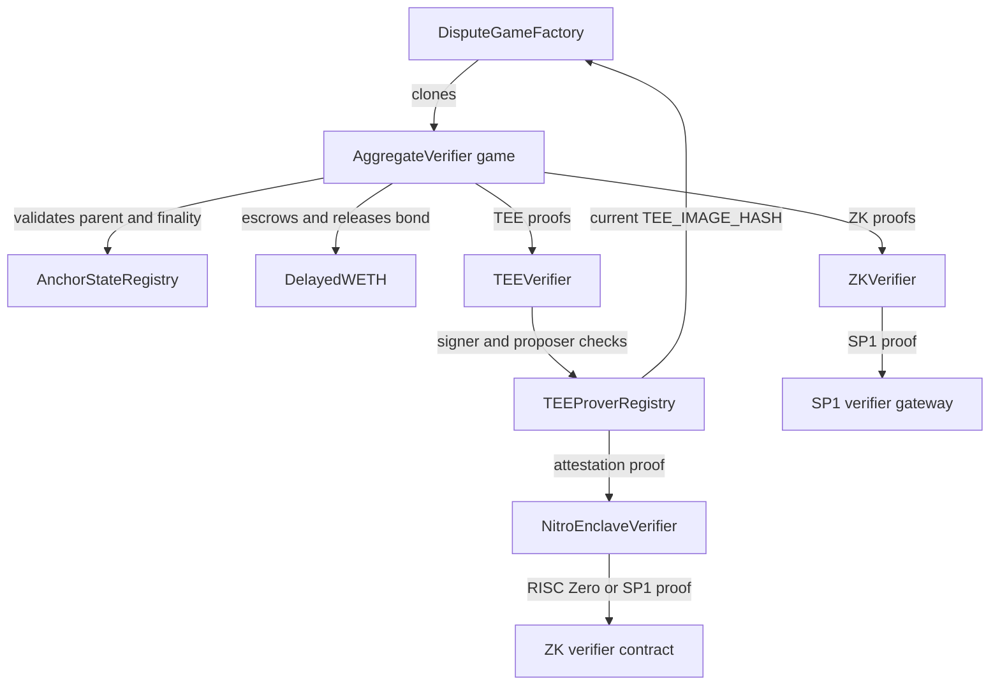

The proof contracts are what turn offchain proof material into onchain checkpoint games. A game asserts an L2 output root for a fixed block interval. The contracts verify the initial proof, accept an optional second proof, let invalid proof material be challenged or nullified, resolve the game after the applicable delay, advance the anchor state, and release the initialization bond.

The contracts in this spec:

- `AnchorStateRegistry`
- `DelayedWETH`
- `DisputeGameFactory`
- `AggregateVerifier`
- `ZKVerifier`
- `TEEVerifier`
- `TEEProverRegistry`
- `NitroEnclaveVerifier`

## Contract graph



`DisputeGameFactory`, `AnchorStateRegistry`, and `DelayedWETH` are proxied system contracts. `AggregateVerifier` is deployed as an implementation and cloned by the factory with immutable arguments. `TEEVerifier`, `ZKVerifier`, `TEEProverRegistry`, and `NitroEnclaveVerifier` are standalone verifier and registry contracts that the game implementation references.

## Data model

The contracts share the same dispute-game types:

| Type         | Meaning                                                                                   |
| ------------ | ----------------------------------------------------------------------------------------- |
| `GameType`   | A `uint32` identifier for a dispute game implementation.                                  |
| `Claim`      | A 32-byte root claim. In this proof system it is an L2 output root.                       |
| `Hash`       | A 32-byte hash wrapper.                                                                   |
| `Timestamp`  | A `uint64` timestamp wrapper.                                                             |
| `Proposal`   | `(root, l2SequenceNumber)`, where `l2SequenceNumber` is the L2 block number for the root. |
| `GameStatus` | `IN_PROGRESS`, `CHALLENGER_WINS`, or `DEFENDER_WINS`.                                     |
| `ProofType`  | `TEE` or `ZK` inside `AggregateVerifier`.                                                 |

The `AggregateVerifier` game has two block intervals:

```text
BLOCK_INTERVAL
INTERMEDIATE_BLOCK_INTERVAL
```

`BLOCK_INTERVAL` is the distance between a parent output root and a proposed output root. `INTERMEDIATE_BLOCK_INTERVAL` is the spacing between intermediate roots inside that range. Both must be non-zero, and `BLOCK_INTERVAL` must be divisible by `INTERMEDIATE_BLOCK_INTERVAL`.

The number of intermediate roots in every game is:

```text
BLOCK_INTERVAL / INTERMEDIATE_BLOCK_INTERVAL
```

The final intermediate root must equal the game's `rootClaim`.

## Game lifecycle

1. The factory owner configures a game type with an `AggregateVerifier` implementation and an initialization bond.
2. TEE operators register enclave signer addresses in `TEEProverRegistry` using ZK-verified Nitro attestation.
3. A proposer creates a game through `DisputeGameFactory.createWithInitData()`, paying the exact initialization bond and supplying an initial TEE or ZK proof.
4. The game validates its parent, L2 block number, intermediate roots, L1 origin, and proof journal. The bond is deposited into `DelayedWETH`.
5. A second proof can be submitted through `verifyProposalProof()`. If the proposal is invalid, challengers can call `challenge()` or `nullify()` with proof material for an intermediate root.
6. After the expected resolution time, anyone can call `resolve()`. The result is `DEFENDER_WINS` for a valid unchallenged game and `CHALLENGER_WINS` for a successful challenge or invalid parent.
7. After resolution and the registry finality delay, anyone can call `closeGame()` to make a best-effort anchor update.
8. The bond recipient calls `claimCredit()` twice: once to unlock the `DelayedWETH` credit, then again after the `DelayedWETH` delay to withdraw and receive ETH.

## DisputeGameFactory

`DisputeGameFactory` creates and indexes dispute-game clones. Each game has a unique identifier:

```text
keccak256(abi.encode(gameType, rootClaim, extraData))
```

The factory stores that UUID in `_disputeGames` and also appends a packed `GameId` to `_disputeGameList` for index-based discovery. Offchain services find games via `DisputeGameCreated`, `gameAtIndex()`, and `findLatestGames()`.

### Configuration

Only the factory owner can:

- set a game implementation with `setImplementation(gameType, impl)`
- set a game implementation plus opaque implementation args with `setImplementation(gameType, impl, args)`
- set the exact required creation bond with `setInitBond(gameType, initBond)`

Creation reverts when the implementation is unset, the paid value disagrees with `initBonds`, or a game with the same UUID already exists.

### Clone arguments

With no implementation args configured, the clone-with-immutable-args payload is:

| Bytes          | Description                           |
| -------------- | ------------------------------------- |
| `[0, 20)`      | Game creator address                  |
| `[20, 52)`     | Root claim                            |
| `[52, 84)`     | Parent L1 block hash at creation time |
| `[84, 84 + n)` | Opaque game `extraData`               |

With implementation args configured, the payload is:

| Bytes                  | Description                           |
| ---------------------- | ------------------------------------- |
| `[0, 20)`              | Game creator address                  |
| `[20, 52)`             | Root claim                            |
| `[52, 84)`             | Parent L1 block hash at creation time |
| `[84, 88)`             | Game type                             |
| `[88, 88 + n)`         | Opaque game `extraData`               |
| `[88 + n, 88 + n + m)` | Opaque implementation args            |

`AggregateVerifier` uses the standard layout. Its `extraData` is specified in the `AggregateVerifier` section below.

## AnchorStateRegistry

`AnchorStateRegistry` is the source of truth for whether a dispute game can be trusted by the proof system. It stores:

- the `SystemConfig`
- the `DisputeGameFactory`
- the starting anchor root
- the current anchor game, if one has been accepted
- the current respected game type
- a game blacklist
- a retirement timestamp
- a dispute-game finality delay

The initial retirement timestamp is set during first initialization. Games created at or before the retirement timestamp are retired.

### Game predicates

The registry exposes these predicates:

| Predicate                 | True when                                                                                                                      |
| ------------------------- | ------------------------------------------------------------------------------------------------------------------------------ |
| `isGameRegistered(game)`  | The factory maps the game's `(gameType, rootClaim, extraData)` back to the same address, and the game points at this registry. |
| `isGameRespected(game)`   | The game reports that its game type was respected when it was created.                                                         |
| `isGameBlacklisted(game)` | The guardian has blacklisted the game address.                                                                                 |
| `isGameRetired(game)`     | `game.createdAt() <= retirementTimestamp`.                                                                                     |
| `isGameResolved(game)`    | The game has a non-zero `resolvedAt` and ended with `DEFENDER_WINS` or `CHALLENGER_WINS`.                                      |
| `isGameProper(game)`      | The game is registered, not blacklisted, not retired, and the system is not paused.                                            |
| `isGameFinalized(game)`   | The game is resolved and more than `disputeGameFinalityDelaySeconds` have elapsed since `resolvedAt`.                          |
| `isGameClaimValid(game)`  | The game is proper, respected, finalized, and resolved with `DEFENDER_WINS`.                                                   |

`isGameProper()` is not a statement about the correctness of the root claim. It only certifies that the game has not been invalidated by registry-level controls. Consumers that need claim validity must use `isGameClaimValid()`.

### Guardian controls

The `SystemConfig.guardian()` can:

- set the respected game type
- update the retirement timestamp to the current block timestamp
- blacklist individual games

These controls are the onchain safety valves for invalidating games before they can become valid claims.

### Anchor updates

`getAnchorRoot()` returns the starting anchor root until an anchor game has been accepted. After that, it returns the root claim and L2 block number of `anchorGame`.

`setAnchorState(game)` accepts a new anchor game only when:

- `isGameClaimValid(game)` is true
- the game's L2 sequence number is greater than the current anchor root's sequence number

The update is permissionless and self-validating.

## DelayedWETH

`DelayedWETH` is WETH with delayed withdrawals. It escrows game bonds and forces a two-step credit claim:

1. The game calls `unlock(subAccount, amount)` for the bond recipient.
2. After `delay()` seconds, the game calls `withdraw(subAccount, amount)` and sends ETH to the recipient.

Unlocks are keyed by:

```text
withdrawals[msg.sender][subAccount]
```

For proof games, `msg.sender` is the `AggregateVerifier` game contract and `subAccount` is the current `bondRecipient`.

Withdrawals revert while the system is paused. The proxy admin owner also holds emergency recovery powers:

- `recover(amount)` sends up to `amount` ETH from the contract to the owner.
- `hold(account)` or `hold(account, amount)` pulls WETH from an account into the owner address.

## AggregateVerifier

`AggregateVerifier` is the dispute-game implementation for checkpoint proofs. Every factory-created game is a clone with immutable game data. The implementation itself owns no per-game storage beyond the clone's storage.

### Constructor configuration

An implementation fixes these values for all clones of that game type:

| Value                         | Purpose                                                  |
| ----------------------------- | -------------------------------------------------------- |
| `GAME_TYPE`                   | The dispute-game type served by this implementation.     |
| `ANCHOR_STATE_REGISTRY`       | Parent validation, claim validity, and anchor updates.   |
| `DISPUTE_GAME_FACTORY`        | Read from the registry during construction.              |
| `DELAYED_WETH`                | Bond escrow.                                             |
| `TEE_VERIFIER`                | Verifier for TEE signatures.                             |
| `TEE_IMAGE_HASH`              | Expected TEE image hash committed into TEE journals.     |
| `ZK_VERIFIER`                 | Verifier for ZK proofs.                                  |
| `ZK_RANGE_HASH`               | Range-program hash committed into ZK journals.           |
| `ZK_AGGREGATE_HASH`           | Aggregate-program hash passed to the ZK verifier.        |
| `CONFIG_HASH`                 | Rollup configuration hash committed into proof journals. |
| `L2_CHAIN_ID`                 | L2 chain the game argues about.                          |
| `BLOCK_INTERVAL`              | Distance from parent block to proposed block.            |
| `INTERMEDIATE_BLOCK_INTERVAL` | Distance between intermediate checkpoint roots.          |
| `PROOF_THRESHOLD`             | Number of proofs required to resolve, either `1` or `2`. |

`PROOF_THRESHOLD` governs resolution, not proof submission. The game can store one TEE proof, one ZK proof, or both.

### Game extra data

`AggregateVerifier.extraData()` is encoded as:

| Bytes               | Description                                                            |
| ------------------- | ---------------------------------------------------------------------- |
| `[0, 32)`           | Proposed L2 block number.                                              |
| `[32, 52)`          | Parent address. The first game uses the `AnchorStateRegistry` address. |
| `[52, 52 + 32 * n)` | Ordered intermediate output roots.                                     |

where:

```text
n = BLOCK_INTERVAL / INTERMEDIATE_BLOCK_INTERVAL
```

The final intermediate output root must equal `rootClaim`.

### Initialization

`initializeWithInitData(proof)` runs exactly once. It checks the calldata size so unused bytes cannot fabricate multiple factory UUIDs for the same logical proposal.

During initialization the game:

1. Checks that the final intermediate root matches `rootClaim`.
2. Resolves the starting root. If `parentAddress` is the registry address, the starting root is `AnchorStateRegistry.getStartingAnchorRoot()`. Otherwise the parent must be a valid registered game.
3. Requires:

   ```text
   l2SequenceNumber == startingL2SequenceNumber + BLOCK_INTERVAL
   ```

4. Records `createdAt`, `wasRespectedGameTypeWhenCreated`, and an initial `expectedResolution`.
5. Verifies the claimed L1 origin hash in the initialization proof against either `blockhash()` or EIP-2935 history.
6. Verifies the supplied TEE or ZK proof.
7. Records the initial prover, sets `bondRecipient` to `gameCreator`, and deposits the bond into `DelayedWETH`.

The initialization proof format is:

| Bytes       | Description                            |
| ----------- | -------------------------------------- |
| `[0, 1)`    | `ProofType`: `0` for TEE, `1` for ZK.  |
| `[1, 33)`   | L1 origin hash.                        |
| `[33, 65)`  | L1 origin block number.                |
| `[65, end)` | Proof bytes for the selected verifier. |

The L1 origin block must lie in the past. Native `blockhash()` is used for block ages up to 256 blocks. EIP-2935 history is used up to 8191 blocks. Older or unavailable L1 origin blocks revert.

### Additional proofs

`verifyProposalProof(proofBytes)` adds the missing proof type while a game is in progress and not over. It does not re-read a new L1 origin from calldata; instead it uses the `l1Head()` captured by the factory at clone creation.

The additional proof format is:

| Bytes      | Description                            |
| ---------- | -------------------------------------- |
| `[0, 1)`   | `ProofType`: `0` for TEE, `1` for ZK.  |
| `[1, end)` | Proof bytes for the selected verifier. |

A game cannot store more than one proof of the same type.

### Proof journals

TEE and ZK proofs commit to the same transition shape:

```text
proposer
l1OriginHash
startingRoot
startingL2SequenceNumber
endingRoot
endingL2SequenceNumber
intermediateRoots
CONFIG_HASH
proof-system-specific hash
```

For TEE proofs the final field is `TEE_IMAGE_HASH` and the journal is checked by `TEEVerifier`. The game calls:

```text
TEE_VERIFIER.verify(proposer || signature, TEE_IMAGE_HASH, keccak256(journal))
```

For ZK proofs the final field is `ZK_RANGE_HASH` and the proof is checked by `ZKVerifier`. The game calls:

```text
ZK_VERIFIER.verify(proofBytes, ZK_AGGREGATE_HASH, keccak256(journal))
```

### Resolution delay

`expectedResolution` is derived from the number of currently accepted proofs:

| Proof count | Delay                                       |
| ----------- | ------------------------------------------- |
| `0`         | Never resolvable.                           |
| `1`         | `SLOW_FINALIZATION_DELAY`, fixed at 7 days. |
| `2`         | `FAST_FINALIZATION_DELAY`, fixed at 1 day.  |

Adding a proof can only push `expectedResolution` earlier. Nullifying a proof can push it later. A challenge with a ZK proof sets `expectedResolution` to 7 days from the challenge so the challenge can itself be nullified.

### Challenge

`challenge(proofBytes, intermediateRootIndex, intermediateRootToProve)` challenges a TEE-backed proposal with a ZK proof for one intermediate interval.

The call is accepted only when:

- the game is still `IN_PROGRESS`
- the game itself is valid according to the registry
- the parent has not resolved with `CHALLENGER_WINS`
- the game has a TEE proof
- the game does not already have a ZK proof
- the supplied proof type is ZK
- the challenged index is in range
- the supplied root differs from the currently proposed intermediate root

When the ZK proof verifies, the game records the ZK prover, increments `proofCount`, stores the 1-based countered intermediate index, and emits `Challenged`. On resolution the challenger receives the bond and the game status becomes `CHALLENGER_WINS`.

### Nullification

`nullify(proofBytes, intermediateRootIndex, intermediateRootToProve)` removes an already accepted proof by proving a contradictory intermediate root.

For an unchallenged game, the target root must differ from the proposed intermediate root. For a challenged game, only the challenged index can be nullified, only with a ZK proof, and the supplied root must equal the original proposed intermediate root.

After a successful nullification:

- the prover slot for that proof type is deleted
- `proofCount` decreases
- `expectedResolution` is recalculated
- the countered index is cleared if the ZK challenge was nullified
- the corresponding verifier contract is nullified

Verifier nullification is a global safety stop. Once `TEE_VERIFIER.nullify()` or `ZK_VERIFIER.nullify()` succeeds, future proof verification through that verifier reverts until the system is upgraded or reconfigured.

### Resolve, close, and bonds

`resolve()` is permissionless. The parent must be resolved unless the parent is the registry itself. If the parent resolved with `CHALLENGER_WINS`, or later became blacklisted or retired, the child also resolves with `CHALLENGER_WINS`. Otherwise the game must be over and must hold at least `PROOF_THRESHOLD` accepted proofs.

If the game was challenged, `resolve()` sets `CHALLENGER_WINS` and moves the bond recipient to the ZK prover. Otherwise it sets `DEFENDER_WINS`.

`closeGame()` is permissionless. It reverts while the registry is paused, requires the game to be resolved and finalized by the registry, and then attempts `AnchorStateRegistry.setAnchorState()`. The anchor update is best-effort: if the registry rejects the game because it is no longer the newest valid claim, `closeGame()` swallows that registry revert.

`claimCredit()` has two phases:

1. Unlock the bond in `DelayedWETH`.
2. After the `DelayedWETH` delay, withdraw WETH and send ETH to `bondRecipient`.

If accepted proofs have been nullified and `expectedResolution` is reset to the never-resolvable sentinel, `claimCredit()` is blocked until 14 days after `createdAt`. This stops a stuck game from locking the bond forever.

## ZKVerifier

`ZKVerifier` adapts the Succinct SP1 verifier gateway to the common `IVerifier` interface used by `AggregateVerifier`.

The call:

```text
verify(proofBytes, imageId, journal)
```

runs:

```text
SP1_VERIFIER.verifyProof(imageId, abi.encodePacked(journal), proofBytes)
```

and returns `true` if the SP1 gateway does not revert. `imageId` is the aggregate program verification key supplied by the game, and `journal` is the hash of the public inputs assembled by the game.

`ZKVerifier` inherits verifier nullification. Once a proper respected game nullifies the verifier, all future `verify()` calls revert.

## TEEVerifier

`TEEVerifier` verifies TEE proof signatures against the `TEEProverRegistry`.

The proof bytes passed to `TEEVerifier` are:

| Bytes      | Description              |
| ---------- | ------------------------ |
| `[0, 20)`  | Proposer address.        |
| `[20, 85)` | 65-byte ECDSA signature. |

The signature is recovered over the journal hash directly. It is not wrapped with the Ethereum signed-message prefix.

A TEE proof is valid only when:

- the proof is at least 85 bytes
- the signature recovers cleanly
- the proposer is allowlisted in `TEEProverRegistry`
- the recovered signer is registered in `TEEProverRegistry`
- the signer's registered image hash equals the `imageId` supplied by the calling game

The image-hash check stops an enclave registered for one image from producing accepted proofs for a game type or upgrade that expects another image.

`TEEVerifier` also inherits verifier nullification.

## TEEProverRegistry

`TEEProverRegistry` manages TEE signer registration and proposer allowlisting.

The registry holds:

- an owner
- a manager
- a `NitroEnclaveVerifier`
- a `DisputeGameFactory`
- a configurable `gameType`
- registered signer state
- proposer allowlist state

The owner can set proposer addresses and change the `gameType`. The owner or manager can register and deregister signers.

### Expected image hash

The registry reads the expected TEE image hash from the current game implementation:

```text
DisputeGameFactory.gameImpls(gameType).TEE_IMAGE_HASH()
```

`setGameType()` checks that this call succeeds and returns a non-zero hash. `isValidSigner()` returns true only when the signer is registered and its stored image hash matches the current expected hash.

Signer registration is itself PCR0-agnostic. This lets operators pre-register signers for a future image before a game-type migration. Those signers do not become valid for proof submission until the game implementation's `TEE_IMAGE_HASH` matches their registered image hash.

### Signer registration

`registerSigner(output, proofBytes)` calls:

```text
NITRO_VERIFIER.verify(output, ZkCoProcessorType.RiscZero, proofBytes)
```

The returned journal must have `VerificationResult.Success`. The attestation timestamp must not be older than `MAX_AGE`, which is fixed at 60 minutes. The public key must be exactly 65 bytes in uncompressed ANSI X9.62 form:

```text
0x04 || x || y
```

The registry derives the signer address as:

```text
address(uint160(uint256(keccak256(x || y))))
```

It pulls PCR0 out of the journal and stores:

```text
signerImageHash[signer] = keccak256(pcr0.first || pcr0.second)
```

It then marks the signer as registered and adds it to an enumerable signer set.

### Deregistration

`deregisterSigner(signer)` deletes the signer's registration and image hash, removes it from the enumerable set, and emits `SignerDeregistered`.

`getRegisteredSigners()` returns the current enumerable set. Ordering is not guaranteed.

## NitroEnclaveVerifier

`NitroEnclaveVerifier` verifies ZK proofs of AWS Nitro Enclave attestation documents. It is the attestation verifier used by `TEEProverRegistry`.

The contract supports:

- single-attestation verification
- batch attestation verification
- RISC Zero and Succinct SP1 proof systems
- root certificate configuration
- trusted intermediate certificate caching
- certificate revocation
- route-specific verifier selection
- permanently frozen proof routes

### Roles and configuration

The owner controls:

- `rootCert`
- `maxTimeDiff`
- `proofSubmitter`
- `revoker`
- ZK verifier configuration
- verifier program IDs
- aggregator program IDs
- route-specific verifier overrides
- route freezing

The `revoker` can also revoke trusted intermediate certificates. `proofSubmitter` is the only address allowed to call `verify()` or `batchVerify()`.

`zkConfig[zkCoProcessor]` stores:

| Field          | Purpose                                         |
| -------------- | ----------------------------------------------- |
| `verifierId`   | Program ID for single-attestation verification. |
| `aggregatorId` | Program ID for batch verification.              |
| `zkVerifier`   | Default verifier contract address.              |

Route-specific verifier overrides are keyed by `(zkCoProcessor, selector)`, where `selector` is the first four bytes of `proofBytes`. If a route is frozen, verification through that route permanently reverts.

### Single verification

`verify(output, zkCoprocessor, proofBytes)`:

1. Requires `msg.sender == proofSubmitter`.
2. Resolves the verifier route from the proof selector.
3. Verifies the ZK proof against `zkConfig[zkCoprocessor].verifierId`.
4. Decodes `output` as a `VerifierJournal`.
5. Validates the journal.
6. Emits `AttestationSubmitted`.
7. Returns the journal with its final verification result.

For RISC Zero, proof verification uses:

```text
IRiscZeroVerifier.verify(proofBytes, programId, sha256(output))
```

For Succinct, proof verification uses:

```text
ISP1Verifier.verifyProof(programId, output, proofBytes)
```

### Batch verification

`batchVerify(output, zkCoprocessor, proofBytes)`:

1. Requires `msg.sender == proofSubmitter`.
2. Verifies the ZK proof against `zkConfig[zkCoprocessor].aggregatorId`.
3. Decodes `output` as a `BatchVerifierJournal`.
4. Requires `batchJournal.verifierVk == getVerifierProofId(zkCoprocessor)`.
5. Validates every embedded `VerifierJournal`.
6. Emits `BatchAttestationSubmitted`.
7. Returns the validated journals.

### Journal validation

A successful journal stays successful only when:

- the trusted certificate prefix length is non-zero
- the first certificate equals `rootCert`
- every trusted intermediate certificate is still trusted and unexpired
- every newly supplied certificate is unexpired
- the attestation timestamp is not too old
- the attestation timestamp is not in the future

Attestation timestamps are provided in milliseconds and converted to seconds. The timestamp is valid only when:

```text
timestamp + maxTimeDiff > block.timestamp
timestamp < block.timestamp
```

Certificates beyond the trusted prefix are cached with their expiry timestamps after successful validation. A revoked certificate can become trusted again only if it shows up in a later successful attestation proof and is cached again.

## Cross-contract safety properties

The proof contracts rely on these cross-contract properties:

- Factory uniqueness: a logical `(gameType, rootClaim, extraData)` can create at most one game.
- Parent validity: non-anchor games can only start from a registered, respected, non-retired, non-blacklisted parent that has not lost.
- Monotonic checkpoints: each child game must advance exactly `BLOCK_INTERVAL` L2 blocks from its starting root.
- Intermediate accountability: every proposal commits to all intermediate roots, so challengers can target the first invalid checkpoint interval.
- Verifier separation: TEE and ZK proofs use different verifier contracts and different journal domain separators (`TEE_IMAGE_HASH` versus `ZK_RANGE_HASH`).
- Fast finality requires diversity: a game with two accepted proof types can resolve after one day, while a game with one proof waits seven days.
- Registry finality is separate from game resolution: a game can resolve before the `AnchorStateRegistry` accepts it as a valid claim.
- Safety controls fail closed: pause, blacklist, retirement, verifier nullification, route freezing, and certificate revocation all prevent acceptance rather than expanding trust.

## Administrative surfaces

| Contract               | Privileged role              | Privileged actions                                                                                |
| ---------------------- | ---------------------------- | ------------------------------------------------------------------------------------------------- |
| `DisputeGameFactory`   | Owner                        | Set game implementations, implementation args, and initialization bonds.                          |
| `AnchorStateRegistry`  | Guardian from `SystemConfig` | Set respected game type, blacklist games, update retirement timestamp.                            |
| `DelayedWETH`          | Proxy admin owner            | Recover ETH and hold WETH from accounts.                                                          |
| `TEEProverRegistry`    | Owner                        | Set proposers, update game type, transfer ownership or management.                                |
| `TEEProverRegistry`    | Owner or manager             | Register and deregister TEE signers.                                                              |
| `NitroEnclaveVerifier` | Owner                        | Configure root certificate, time tolerance, proof submitter, revoker, ZK routes, and program IDs. |
| `NitroEnclaveVerifier` | Owner or revoker             | Revoke trusted intermediate certificates.                                                         |

These surfaces are intentionally narrow but high impact. Operational changes here can affect which games are respected, which proofs verify, and which attestations can register new TEE signers.
