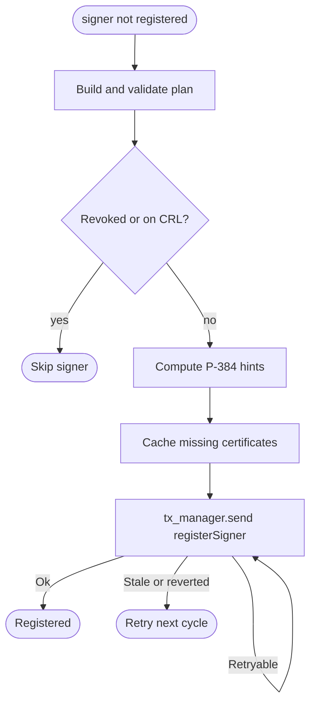

import { Aside } from '@astrojs/starlight/components';

The registrar is an offchain service that keeps the onchain set of accepted TEE signer identities in sync with the actual running prover fleet. It locates live TEE prover instances, pulls each enclave's AWS Nitro attestation document, computes the P-384 inverse hints the onchain verifier needs to check it, and writes the resulting signer registration to [`TEEProverRegistry`](https://github.com/base/contracts/blob/main/src/L1/proofs/tee/TEEProverRegistry.sol) on L1. It also removes signers whose backing instances have disappeared and revokes certificates that AWS has marked as withdrawn.

<Aside type="note" title="Changed at Cobalt">
Before Cobalt, registration went through a ZK proof: the registrar sent each attestation to a RISC Zero prover (normally the Boundless marketplace) and submitted the resulting Groth16 seal. Cobalt removes that step. The attestation is now checked in full by L1 contracts, using the hinted verifier described in [nitro-validator redesign](/architecture/nitro-validator/). No Boundless or RISC Zero code remains in the current registrar. The upstream registrar specification still describes the old proof flow; this page follows the node source.
</Aside>

The Base team operates a single registrar. The proof system trusts only signers that this registrar has admitted, which makes registrar correctness a prerequisite for accepting TEE proofs onchain. The output is still self-validating end-to-end. Every certificate signature, the attestation signature, the enclave PCR0 measurement, and the signer public key are re-checked onchain by `TEEProverRegistry` and its `NitroValidator` and `CertManager` before the signer is treated as valid. The hints only speed that check up. A wrong hint makes the check fail, it cannot make a bad attestation pass.

## Responsibilities

A conforming registrar performs the following work each cycle:

1. Discover the current set of TEE prover instances behind the production load balancer.
2. Fetch per-enclave signer public keys and Nitro attestation documents from each instance.
3. Check the attestation certificate chain against the onchain revocation set and, when enabled, against AWS-published CRLs.
4. Compute P-384 hints for every enclave that is not yet registered, and cache any certificate in the chain that `CertManager` has not verified yet.
5. Submit `TEEProverRegistry.registerSigner()` for newly attested signers.
6. Submit `TEEProverRegistry.deregisterSigner()` for onchain signers whose instances are no longer reachable.
7. Submit `CertManager.revokeCert()` for any certificate found to be revoked.

The registrar deliberately does not gate which PCR0 measurements are admitted. Registration is PCR0-agnostic so the next image's signers can be pre-registered ahead of a hardfork. Whether a proof produced by a given signer is actually accepted is decided onchain by [`TEEVerifier`](https://github.com/base/contracts/blob/main/src/L1/proofs/tee/TEEVerifier.sol), which compares against the active game implementation's current `TEE_IMAGE_HASH`.

The registrar also does not build proposals, generate proof material for proposals or disputes, or challenge invalid state transitions. Those duties live with the proposer, the TEE provers, and the challenger.

## Startup configuration

At startup, the registrar connects to:

- an L1 execution RPC for contract reads and transaction submission
- AWS APIs for ELBv2 target health and EC2 instance metadata
- a JSON-RPC endpoint on each discovered TEE prover instance
- `TEEProverRegistry`
- the `NitroValidator` that the registry reports through `NITRO_VALIDATOR()`, and the `CertManager` that validator points to

The operator supplies only the registry address. The registrar reads the validator and certificate manager addresses from the chain at startup and refuses to start if either is zero. Any onchain signer that is not present in its own instance set is treated as an orphan candidate, so a given `TEEProverRegistry` must be written by exactly one registrar.

## Driver loop

The service runs a single driver loop:

1. Discover the current instance set.
2. Process every instance concurrently, bounded by `max_concurrency`.
3. Read the onchain signer set.
4. Deregister orphan signers.
5. Sleep `poll_interval` seconds, or exit on cancellation.

`step()` runs once at startup before the first sleep. Cancellation is observed promptly between ticks and inside long-running transaction retries, so the service can shut down without leaving partial state behind.

## Instance discovery

Discovery is driven exclusively by AWS ALB target group polling — DNS, SRV, and Kubernetes discovery are not supported.

Each discovery cycle:

1. Calls `elasticloadbalancingv2.DescribeTargetHealth(target_group_arn)`.
2. Drops non-instance targets (IDs that do not start with `i-`).
3. Deduplicates instance IDs that appear on more than one port.
4. Calls `ec2.DescribeInstances(instance_ids)` to read each instance's private IP and launch time.
5. Builds JSON-RPC endpoint URLs shaped like `http://{private_ip}:{prover_port}` and pairs each one with its ALB-reported health state.

ALB health states map to internal states as follows:

| AWS state    | Internal state | `should_register()` |
| ------------ | -------------- | ------------------- |
| `initial`    | `Initial`      | true                |
| `healthy`    | `Healthy`      | true                |
| `draining`   | `Draining`     | false               |
| anything else| `Unhealthy`    | false               |

An `Unhealthy` instance is still allowed to register if it is within `unhealthy_registration_window` seconds of its `launch_time`. This is a warm-up grace period: it gives a freshly launched instance — whose JSON-RPC endpoint may be briefly slow — enough time to complete enclave attestation and registration before the next ALB health check would deregister it. Hint generation is local and fast compared with the old outsourced proof, so the window mainly has to cover enclave start-up and the certificate-cache transactions.

A discovery failure aborts the current tick and skips orphan cleanup. It never deregisters a live signer.

## Per-instance processing

For each discovered instance, the registrar:

1. Calls `enclave_signerPublicKey` to fetch the per-enclave SEC1 public keys. A single instance can host multiple enclaves, and each enclave has its own signer key.
2. Derives the Ethereum signer address from each public key as the last 20 bytes of `keccak256(uncompressed_pubkey_xy)`.
3. Returns immediately when no signers were reported — that instance contributes nothing to the active set, and the call becomes a no-op.
4. Decides whether the instance is currently registerable: `Initial` and `Healthy` instances proceed; `Unhealthy` instances inside the warm-up window also proceed; every other state contributes its addresses to the active set but does not generate new proofs or transactions.
5. Calls `enclave_signerAttestation` once with one nonce per signer. Each nonce is deterministic: `keccak256` over the domain string `base-proof-tee-registrar:attestation-nonce:v1`, the registry address, and the signer address. That binds each attestation to one signer and one registry, and the registrar rejects any plan whose nonce does not match.
6. Runs CRL checks once per batch when CRL checking is enabled. Each enclave signs with its own key, but AWS Nitro attestations are signed by the parent EC2 instance's Nitro Hypervisor, whose signing key is endorsed by a per-instance AWS-issued certificate chain. Every enclave on a given instance therefore lives under the same parent chain, so one CRL check per instance is sufficient.
7. Runs the registration pipeline for each signer address.

All reachable instances contribute to the active signer set, including `Draining` and `Unhealthy` ones. This prevents an instance that is rotating in or out from being deregistered prematurely.

## Registration plan and hints

For each signer that is not yet onchain, the registrar first turns the raw attestation into a registration plan. The planner parses the `COSE_Sign1` envelope strictly, keeping the raw protected header and payload so the signed bytes can be rebuilt exactly. The plan lists the certificate chain from the AWS root down to the leaf, with each certificate's hash, parent hash, and revocation ID.

Before any transaction, the plan must pass these checks:

- The signer in the plan equals the signer the instance reported.
- The nonce equals the deterministic nonce for that signer and registry.
- PCR0 is a 48-byte value and is not the debug-mode measurement.
- The chain starts at the pinned Nitro root, whose hash is `0x311d96fcd5c5e0ccf72ef548e2ea7d4c0cd53ad7c4cc49e67471aed41d61f185`.
- Every entry before the last is a CA certificate, the last is the leaf, and each parent hash links to the one before it.
- The attestation timestamp is not in the future and is younger than `max_attestation_age`.

The registrar then computes the P-384 hints. It walks the same affine point schedule the onchain verifier uses and records every modular inverse as a 48-byte big-endian value. There is one hint set per certificate signature, plus one for the attestation signature. This runs on a blocking thread, and a semaphore caps how many hint jobs run at once.

The default freshness window is 3300 seconds, kept under the onchain `MAX_AGE` of 3600 seconds so a plan that passes locally still lands before it ages out onchain.

### Certificate caching

`CertManager` stores every certificate it has already verified. Before registering, the registrar walks the chain and, for each certificate not yet cached, sends one caching transaction: `verifyCACertWithHints` for a CA and `verifyClientCertWithHints` for the leaf. A per-certificate lock stops two signers that share a chain from caching the same certificate twice. Once the leaf is cached, later attestations under that leaf take the short path.

## Registration transactions

For each unregistered signer, the registrar:

1. Calls `TEEProverRegistry.isRegisteredSigner(signer)` and skips the signer if it returns true.
2. Builds the plan and hints, and caches any missing certificates, as described above.
3. ABI-encodes `registerSigner(attestationTbs, signature, hints)` (selector `0xb39dc09d`).
4. Submits the transaction through the L1 transaction manager.
5. Retries failed submissions according to the rules below.
6. Increments the registration counter on a successful receipt.

The transaction retry rules are:

| Failure                       | Required behavior                                                                                       |
| ----------------------------- | ------------------------------------------------------------------------------------------------------- |
| Retryable error               | Sleep `tx_retry_delay`, then retry, up to `max_tx_retries` total attempts.                              |
| `ExecutionReverted` revert    | Return the error. The next cycle fetches a fresh attestation and builds a new plan.                    |
| Insufficient funds, fee cap   | Treat as non-retryable. Surface the error and stop attempting this signer for the current cycle.        |
| Reverted receipt              | Treat as a transaction failure even when submission succeeded.                                          |
| Reported error after mining   | Re-read `isRegisteredSigner(signer)`. If true, treat the attempt as success.                            |

The post-error reconciliation matters because fee-bumping and nonce races can surface errors even when the underlying transaction has already been mined. Without the recheck, the registrar would redo hinting and send another transaction for a signer that is already registered.

Transaction submission is cancellation-aware: both the active send and the inter-attempt sleep abort cleanly on shutdown, so the next process starts from a clean nonce state without committing a partial transaction.

## Orphan deregistration

After every instance has been processed, the registrar reconciles the onchain signer set against the active set:

1. Skip cleanup if discovery failed during this tick.
2. Skip cleanup if cancellation was requested.
3. Compare reachable instances against total discovered instances. If `reachable_instances * 2 <= total_instances`, skip cleanup.
4. Read the onchain set with `TEEProverRegistry.getRegisteredSigners()`.
5. Compute `orphans = onchain_signers \ active_signers`.
6. For each orphan, in order:
   1. Recheck `isRegisteredSigner(signer)`. Skip if it returns false.
   2. ABI-encode `deregisterSigner(signer)` and submit it through the transaction manager.

The majority-reachable guard exists so that a transient AWS or VPC outage cannot deregister most of the prover fleet at once. The per-orphan `isRegisteredSigner` recheck is a race guard: the set returned by `getRegisteredSigners()` is read once per cycle, and a different writer might have deregistered the signer between that read and this transaction. Skipping signers that are already gone avoids wasted gas on a no-op transaction.

The procedure assumes a single registrar per `TEEProverRegistry`. Two registrars sharing a registry would each treat the other's signers as orphans.

## Certificate revocation

Revocation now lives on `CertManager` and is keyed by a certificate's issuer and serial number rather than by its position in a chain. The registrar applies two layers, in order.

### Layer 1: onchain revocation pre-check

For the pinned root and every certificate in the plan, the registrar asks `CertManager` whether that ID is revoked. Any hit stops registration for that signer. This check runs even for signers that are already registered, so a revoked chain is noticed as early as possible.

### Layer 2: AWS CRL distribution points

This layer runs only when CRL checking is on. For certificates that pass Layer 1, the registrar:

1. Parses each CRL distribution point from the chain.
2. Accepts only URLs whose host ends in `.amazonaws.com` and contains the `nitro-enclave` keyword. Redirects are off and responses are capped at 10 MiB.
3. Fetches the CRL with a 30-second timeout.
4. Looks up the certificate's serial number.
5. Submits `CertManager.revokeCert(certId)` for any revoked certificate it finds.
6. Blocks registration for that signer.

A recorded revocation protects every later registration that shares the same chain, because Layer 1 catches it on the next pass without a network fetch.

<Aside type="caution" title="CRL flag quirk">
CRL checking is still switched on by setting `CRL_NITRO_VERIFIER_ADDRESS`. In the current source only the presence of that value matters. The address itself is not used: revocation reads and writes go to the `CertManager` found through the registry.
</Aside>

## Pending registration lifecycle

Each signer has at most one registration task in flight, keyed by its address. A task runs through these stages:

A stale attestation, a reverted transaction, or a cancelled task all end the attempt. The next cycle starts again from a fresh attestation, so a signer cannot get stuck.

## Onchain interactions

The registrar issues the following contract calls. `TEEProverRegistry.isValidSigner()` is intentionally never called by the registrar — that predicate is enforced by `TEEVerifier` at proof-submission time and includes an image-hash match that the registrar itself cannot satisfy.

| Contract                                                                                                                   | Method                          | Caller path                                         |
| -------------------------------------------------------------------------------------------------------------------------- | ------------------------------- | --------------------------------------------------- |
| [`TEEProverRegistry`](https://github.com/base/contracts/blob/main/src/L1/proofs/tee/TEEProverRegistry.sol)                 | `registerSigner(attestationTbs, signature, hints)` | Per-signer registration transaction.                |
| `TEEProverRegistry`                 | `NITRO_VALIDATOR()`             | Startup, to find the validator.                     |
| `NitroValidator`                    | `certManager()`                 | Startup, to find the certificate manager.           |
| `CertManager`                       | `verifyCACertWithHints` / `verifyClientCertWithHints` | Caching a certificate that is not yet verified. |
| [`TEEProverRegistry`](https://github.com/base/contracts/blob/main/src/L1/proofs/tee/TEEProverRegistry.sol)                 | `deregisterSigner(signer)`      | Per-orphan deregistration transaction.              |
| [`TEEProverRegistry`](https://github.com/base/contracts/blob/main/src/L1/proofs/tee/TEEProverRegistry.sol)                 | `isRegisteredSigner(signer)`    | Pre-check, post-error reconciliation, orphan race guard. |
| [`TEEProverRegistry`](https://github.com/base/contracts/blob/main/src/L1/proofs/tee/TEEProverRegistry.sol)                 | `getRegisteredSigners()`        | Once per cycle for orphan computation.              |
| `CertManager`                       | `revokeCert(certId)`            | When an AWS CRL lists a certificate.                |
| `CertManager`                       | revocation lookup by issuer and serial | Layer-1 onchain revocation pre-check.       |

PCR0 enforcement happens onchain at proof submission, not at registration. The registrar registers any enclave whose Nitro attestation verifies, regardless of PCR0 value. That makes it possible to bring up the next image's fleet and pre-register its signers before a hardfork; those signers cannot produce accepted proposals until the active game implementation's `TEE_IMAGE_HASH` matches their registered image hash.

## Service lifecycle

At startup, the registrar:

1. Parses CLI configuration and validates it.
2. Initializes tracing and installs the `rustls` ring crypto provider.
3. Installs a signal handler that triggers a cancellation token.
4. Initializes Prometheus metrics, including L1 wallet balance monitoring.
5. Builds the L1 provider, transaction manager, AWS SDK clients, and discovery client.
6. Builds the registry client, then reads the `NitroValidator` and `CertManager` addresses from the chain.
7. Starts the health server and marks readiness.
8. Starts the driver loop.

The health endpoint reports ready as soon as wiring completes. Connectivity gating is intentionally omitted because the registrar is outbound-only.

Each driver tick:

1. Discovers instances.
2. Processes instances concurrently.
3. Computes orphans subject to the majority-reachable guard.
4. Submits deregistration transactions for any confirmed orphans.

Shutdown is driven by a cancellation token. The driver loop exits, in-flight per-instance futures are dropped, the readiness flag clears, the `up` metric is set to zero, and the health server is joined.

## Operator inputs

A registrar needs:

| Input | Env variable | Default |
|---|---|---|
| L1 RPC endpoint | `L1_RPC_URL` | none |
| `TEEProverRegistry` address | `TEE_PROVER_REGISTRY_ADDRESS` | none |
| ALB target group ARN | `TARGET_GROUP_ARN` | none |
| AWS region | `AWS_REGION` | none |
| Prover JSON-RPC port | `PROVER_PORT` | `8000` |
| Maximum attestation age | `MAX_ATTESTATION_AGE_SECS` | `3300` |
| Poll interval | `POLL_INTERVAL_SECS` | `30` |
| Prover JSON-RPC timeout | `PROVER_TIMEOUT_SECS` | `30` |
| Concurrent instances per cycle | `MAX_CONCURRENCY` | built-in default |
| Cycles to keep signers of an instance missing from discovery | `INSTANCE_CACHE_TTL_CYCLES` | built-in default |
| Transaction retries | `MAX_TX_RETRIES` | built-in default |
| First retry delay | `TX_RETRY_DELAY_SECS` | built-in default |

It also needs an L1 transaction signer (a local key, or a remote signer plus the expected address) and the transaction manager settings. Retry delays double on each attempt, up to 60 seconds.

Optional inputs are `CRL_NITRO_VERIFIER_ADDRESS` (turns CRL checks on, see the caution above), the health server bind address and port, logging, and Prometheus metrics settings. The Boundless, RISC Zero, and guest ELF inputs are gone.

## Safety requirements

Any registrar implementation must preserve these safety properties:

- Never deregister live signers because of a transient AWS or VPC outage. Apply the majority-reachable guard before any deregistration.
- Treat `Draining` and `Unhealthy` instances as part of the active set as long as their JSON-RPC endpoint responds, so rotations do not race deregistration.
- Request each attestation with the deterministic per-signer nonce and reject any plan whose nonce, signer, root, or chain links do not match.
- Reject debug-mode PCR0 values before any transaction.
- Reject attestations older than `max_attestation_age`, keeping every submission inside the onchain `MAX_AGE` window.
- Recheck `isRegisteredSigner` after a transaction error to absorb fee-bump and nonce-race false negatives.
- Recheck `isRegisteredSigner` for every orphan candidate immediately before submitting a deregistration, so a concurrent writer or an earlier in-flight transaction cannot cause a redundant deregistration.
- Run the onchain revocation pre-check before fetching network CRLs, so a certificate revoked once stays revoked.
- Restrict CRL fetches to allowlisted hosts and bound the response size to defeat SSRF and resource-exhaustion attacks.
- Treat unavailable AWS APIs, unreachable prover endpoints, and transient RPC errors as retryable conditions for the next tick — not as deregistration or failure signals.
