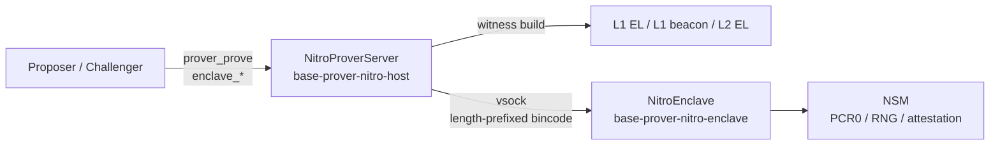

The TEE prover is the offchain service that produces signed proof material for `AggregateVerifier` games by re-deriving and re-executing an L2 block range inside an AWS Nitro Enclave. The same service powers both proposal creation and dispute nullification: callers (proposer or challenger) submit a block range, the host gathers witness data, the enclave re-executes the range, and a per-instance key that lives only inside the enclave signs the resulting journal.

Verification of the signature is self-contained onchain. `TEEVerifier` recovers the signer from each proposal and checks it against `TEEProverRegistry` for the active game implementation's `TEE_IMAGE_HASH`. A signer from a different enclave image, or one that has been deregistered, cannot satisfy verification. The Nitro hypervisor's per-instance attestation binds the signer's public key to a specific PCR0, which the [registrar](/specifications/registrar) certifies separately.

## Responsibilities

A conforming TEE prover stack:

1. Serve `prover_prove` for proposal and dispute ranges over JSON-RPC.
2. Collect witness data from canonical L1, L1 beacon, and L2 RPCs on the host.
3. Forward content-verified preimages to the enclave over vsock.
4. Re-derive and re-execute the L2 range inside the enclave and validate the claimed output root against the re-executed one before signing anything.
5. Sign per-block journals and an aggregate journal with a secp256k1 key generated inside the enclave.
6. Expose `enclave_signerPublicKey` and `enclave_signerAttestation` for the registrar.
7. Optionally gate every request on registry signer validity to fail closed against deregistered enclaves.
8. Support multi-enclave deployment on a single EC2 parent so different PCR0 images can run side-by-side across rotations.

The TEE prover never decides whether a proposal or dispute is correct. It re-executes the range, signs the result when the re-execution matches the claim, and returns. Callers still recheck game state before submitting onchain.

## Architecture

The service runs as two processes on a Nitro-capable EC2 parent:

- A **host** binary (`base-prover-nitro-host`) that terminates JSON-RPC, gathers witness data over HTTP, and proxies requests to one or more enclaves.
- An **enclave** binary (`base-prover-nitro-enclave`) packed into an EIF that holds the signing key, exposes a vsock listener, and runs the proof pipeline.

The two processes talk only over vsock. The enclave has no network interface; all external RPC connectivity sits on the host side.



Each vsock connection handles exactly one request before closing. The enclave keeps no per-request state between connections; the only persistent state inside is the signer key and the boot-time PCR0 measurement.

Vsock frames use a `u32` big-endian length prefix followed by a bincode payload, with a 5-minute read timeout. The transport caps write chunks at 28 KiB to dodge a Linux kernel `virtio_vsock` SKB corruption bug.

## JSON-RPC interface

The host serves two JSON-RPC namespaces on a single HTTP listener, plus an HTTP `GET /healthz` proxy that routes to the JSON-RPC `healthz` method.

| Method                       | Purpose                                                                  |
| ---------------------------- | ------------------------------------------------------------------------ |
| `prover_prove`               | Produce per-block and aggregate signed proposals for a block range.      |
| `enclave_signerPublicKey`    | Return the 65-byte uncompressed secp256k1 public key for each enclave.   |
| `enclave_signerAttestation`  | Return the COSE_Sign1 attestation document for each enclave.             |
| `healthz` / `GET /healthz`   | Liveness, plus optional onchain signer validity (latching) when enabled. |

The `enclave_*` calls are all-or-nothing across multiple enclaves: a transport failure or an error from any enclave fails the whole response. Callers register every signer together, so a partial response would be unusable.

### prover_prove request

`ProofRequest` fields:

| Field                          | Meaning                                                                                                |
| ------------------------------ | ------------------------------------------------------------------------------------------------------ |
| `l1_head`                      | L1 head block hash anchoring the derivation window.                                                    |
| `l1_head_number`               | L1 head block number.                                                                                  |
| `agreed_l2_head_hash`          | L2 block hash at the parent of the range.                                                              |
| `agreed_l2_output_root`        | Output root at the parent. Used as the starting state.                                                 |
| `claimed_l2_output_root`       | Claimed output root at the target. Trust-critical: the enclave only signs if re-execution matches it.  |
| `claimed_l2_block_number`      | Target L2 block number (ending block of the range).                                                    |
| `proposer`                     | L1 address that will submit the proof. Committed into the journal so onchain `msg.sender` must match.  |
| `intermediate_block_interval`  | Sampling stride for intermediate roots in the aggregate proposal.                                      |
| `image_hash`                   | `keccak256(PCR0)` the caller expects. Currently informational; routing uses onchain signer validity.   |

### prover_prove response

`ProofResult::Tee` carries:

| Field                | Meaning                                                                                       |
| -------------------- | --------------------------------------------------------------------------------------------- |
| `aggregate_proposal` | One `Proposal` covering the full range with sampled intermediate roots.                       |
| `proposals`          | Per-block `Proposal`s in order, each chaining `prev_output_root` to the previous block's root.|

Each `Proposal`:

| Field              | Meaning                                                                            |
| ------------------ | ---------------------------------------------------------------------------------- |
| `output_root`      | Output root at this proposal's ending block.                                       |
| `signature`        | 65-byte secp256k1 ECDSA signature (`r || s || v`) over `keccak256(journal)`.       |
| `l1_origin_hash`   | L1 head hash used during derivation.                                               |
| `l1_origin_number` | L1 head block number.                                                              |
| `l2_block_number`  | Ending L2 block number for this proposal.                                          |
| `prev_output_root` | Output root before this proposal's range.                                          |
| `config_hash`      | Per-chain config hash hardcoded into the enclave.                                  |

A single-block range collapses the aggregate proposal into the lone per-block proposal. For multi-block ranges the aggregate carries its own signature over a journal whose `prev_output_root` is the request's `agreed_l2_output_root`, whose `intermediate_roots` are sampled at `intermediate_block_interval`, and whose `ending_l2_block` is the final block in the range.

### enclave_signerAttestation

Takes optional `user_data` and `nonce` byte arguments. The NSM hardware caps each at 512 bytes, and oversize values are rejected at the host RPC layer before reaching vsock. The host returns one raw `COSE_Sign1` document per configured enclave, in the same order as `enclave_signerPublicKey`. The registrar uses this endpoint to bind each enclave's signer to a fresh attestation before submitting it onchain.

## Proof pipeline

A single `prover_prove` request flows host → vsock → enclave → host:

1. **Host**: `ProverService::prove_block` constructs a `Host` from the prover config, then calls `Host::build_witness` to walk L1 EL, L1 beacon, and L2 EL and populate an `Oracle` with hash-keyed preimages.
2. **Host**: `NitroBackend::prove` flattens the oracle into `(PreimageKey, Vec<u8>)` pairs and `NitroTransport::prove` sends them over vsock as one `EnclaveRequest::Prove(...)` frame.
3. **Enclave**: `Oracle::new` content-verifies every `Keccak256`- or `Sha256`-keyed preimage so the stored value actually hashes to its key.
4. **Enclave**: `BootInfo::load` extracts the proposer, L1 head, agreed/claimed roots, intermediate-block interval, and chain ID from local preimages.
5. **Enclave**: `config_hash_for_chain` looks up a hardcoded per-chain config hash from `CONFIG_HASHES` (computed at first access from `ChainConfig::all()`). Unknown chain IDs return `UnsupportedChain` and refuse to prove.
6. **Enclave**: the proof prologue drives derivation and execution via `driver.execute_with_intermediates()`. The epilogue's `validate()` is the trust-critical gate — it confirms the re-executed final output root matches the request's `claimed_l2_output_root`. Signing only happens after this check passes.
7. **Enclave**: for each block result, build a `ProofJournal` with empty `intermediate_roots` and sign it; chain `prev_output_root` through the loop. Then build and sign the aggregate journal with sampled intermediate roots.
8. **Enclave**: return `EnclaveResponse::Prove(ProofResult::Tee { aggregate_proposal, proposals })`.
9. **Host**: return the result to the JSON-RPC caller, applying the configured proof request timeout (default 1740 s, ~29 minutes).

The proposer consumes both the aggregate and per-block proposals: per-block roots feed `proposeOutputRoots` and the aggregate signature satisfies `AggregateVerifier`. The challenger only uses the aggregate signature, repacking it for `nullify()` via `ProofEncoder::encode_dispute_proof_bytes`. The enclave neither knows nor cares which caller it is serving.

## Signed journal

Each signature is `secp256k1.sign(keccak256(journal))`, serialized as 65 bytes (`r || s || v`). The journal is packed (not ABI-encoded), `196 + 32·N` bytes where `N` is the number of intermediate roots:

```text
proposer(20)        || l1OriginHash(32)   || prevOutputRoot(32)
startingL2Block(8)  || outputRoot(32)     || endingL2Block(8)
intermediateRoots(32 × N)                 || configHash(32)
teeImageHash(32)
```

Per-block proposals have `N == 0` and `startingL2Block == endingL2Block - 1`. Aggregate proposals have `startingL2Block == firstBlock - 1`, `endingL2Block == lastBlock`, and `N == lastBlock / intermediate_block_interval`.

`teeImageHash` is `keccak256(PCR0)` taken at enclave boot. Embedding it into every journal means a signature recovered onchain transitively commits to the exact EIF measurement that produced it. In local mode (no NSM, development and test only), `teeImageHash` is zero.

The signature `v` byte is encoded as the secp256k1 recovery id (`0` or `1`); callers normalize it to whichever EIP-155 form they need before L1 submission.

## Multi-enclave routing

`--vsock-cid` accepts one or more CIDs, so a single host process can attach to multiple enclaves running on the same EC2 parent. Each CID is an independent vsock endpoint that can run a different EIF — a different PCR0, a different `tee_image_hash`, and a different registered signer.

`--tee-prover-registry-address` is required whenever more than one CID is configured. Without the registry there is no deterministic way to pick between enclaves, so multi-enclave deployments are fail-closed-only.

Per-request routing walks configured CIDs in order and picks the first enclave whose signer is currently valid in `TEEProverRegistry`:

1. Fetch the signer public key from the enclave (skip the transport if this fails).
2. Call `isValidSigner(signer)` on `TEEProverRegistry`.
3. If valid, route the request to this enclave. If not, log and continue.
4. If no enclave in the list has a valid signer, fail the request with `NoValidSigner`.

The common operational case is image rotation. Run the old and new EIFs side-by-side; both signers stay registered for the active game implementation's `TEE_IMAGE_HASH` during the overlap window; after the registry switches to the new image hash only the new enclave's signer is valid and every new request routes to it.

`enclave_*` calls fan out to every configured enclave so the registrar can register every signer in one cycle.

## Registration gating and health

Setting `--tee-prover-registry-address` enables two registry-backed behaviors on the host:

- `GET /healthz` only reports healthy after at least one enclave's signer has been confirmed valid onchain. The health flag latches: once an enclave has been seen valid, `/healthz` continues to report healthy even if the registry RPC later fails or the signer is deregistered. This keeps load balancers stable through short outages.
- Every `prover_prove` request consults `RegistrationChecker::select_valid_enclave` before forwarding. A deregistered enclave, or one whose key fetch fails, is skipped. If no enclave is valid the request is rejected with JSON-RPC error code `-32001`.

Without the registry flag, the host is permissive: `/healthz` reports healthy as long as the server is up, and `prover_prove` routes to the first configured enclave.

## Attestation

The signer key is generated inside the enclave at startup and never leaves the enclave process. The `Server::new_enclave` constructor:

1. Opens an NSM session (`nsm_init`).
2. Reads PCR0 (48-byte SHA-384). A wrong-length PCR0 aborts startup.
3. Computes `tee_image_hash = keccak256(PCR0)` and stores it for inclusion in every signed journal.
4. Generates a secp256k1 ECDSA key with `NsmRng`, which calls `nsm_process_request(Request::GetRandom)`.
5. Logs the signer address (no key material).

There is no startup or periodic attestation. Attestations are produced only when the registrar calls `enclave_signerAttestation`. Each call:

1. Opens a fresh NSM session.
2. Calls `nsm_process_request(Request::Attestation { public_key, user_data, nonce })`.
3. Returns the raw COSE_Sign1 bytes.

The attestation document embeds the 65-byte uncompressed public key, all populated PCRs, the AWS-issued certificate chain, the timestamp, and the supplied `user_data`/`nonce`, all signed by the per-instance Nitro hypervisor key. Only PCR0 is consumed by this system — it is the value bound into every signed journal via `teeImageHash = keccak256(PCR0)`. See the [registrar](/specifications/registrar) spec for how attestations are verified and submitted onchain.

## Service lifecycle

The host startup sequence (`ServerArgs::run`):

1. Parse CLI; initialize logging and metrics via `base_cli_utils`.
2. Resolve the `RollupConfig` and L1 chain config from `--l2-chain-id`. Fail on unknown chains.
3. Build one `NitroTransport::vsock(cid, 8000)` per `--vsock-cid`.
4. Construct `NitroProverServer::new_multi(prover_config, transports, timeout)` and, if `--tee-prover-registry-address` is set, wrap with `RegistrationHealthConfig`.
5. Build a jsonrpsee HTTP server with a `/healthz` proxy layer, merge `ProverApiServer`, `EnclaveApiServer`, and one of the healthz modules, and start the server.
6. Block on the server handle; exit on ctrl-C.

The enclave startup sequence (`NitroEnclave::new`):

1. `Server::new()` opens NSM, derives `tee_image_hash`, and generates the signer key.
2. Bind a `VsockListener` on `VMADDR_CID_ANY:8000`.
3. For each connection, spawn a handler that reads one framed `EnclaveRequest`, dispatches to `Server::prove`, `signer_public_key`, or `signer_attestation`, writes the response, and closes the connection.

Per-request flow on the host:

1. (Optional) `select_valid_enclave` chooses a registered enclave.
2. `tokio::time::timeout(proof_request_timeout, enclave.service.prove_block(request))`.
3. On timeout, return JSON-RPC `-32000` with the offending L2 block number.
4. On error from the enclave, return JSON-RPC `-32000` with the underlying error message.

Shutdown is driven by ctrl-C handled by `RuntimeManager`. The jsonrpsee server stops, in-flight requests drain, and the runtime exits. The enclave has no graceful shutdown path; process termination drops NSM file descriptors via `Drop`.

## Operator inputs

A TEE prover host needs:

- L1 execution RPC URL.
- L1 beacon RPC URL.
- L2 execution RPC URL.
- L2 chain ID (used to select the rollup config and per-chain config hash).
- JSON-RPC listen address.
- One or more vsock CIDs, each backed by a Nitro Enclave running the prover EIF.
- Proof request timeout (default 1740 seconds).
- Logging filter and Prometheus metrics settings.

Optional:

- `TEEProverRegistry` address. Required when more than one vsock CID is configured. Enables registration-gated health and per-request signer validation.
- Experimental witness endpoint flag for hosts that expose `debug_executePayload`.

The enclave needs no operator inputs beyond the EIF image and the vsock channel. PCR0 is read at boot from NSM; the signer key is generated from the hardware RNG.

## Safety requirements

A conforming TEE prover preserves these safety properties:

- Generate the signing key inside the enclave from the NSM hardware RNG and never serialize it out of the enclave process.
- Validate the re-executed final output root against the request's `claimed_l2_output_root` before any signing, and refuse to sign if the check fails.
- Embed `tee_image_hash = keccak256(PCR0)` in every signed journal so signatures bind to one EIF measurement.
- Content-verify every hash-keyed preimage as it enters the enclave so derivation cannot consume preimages whose values disagree with their keys.
- Refuse to prove for chain IDs not present in the hardcoded `CONFIG_HASHES` table.
- Cap `user_data` and `nonce` at the NSM 512-byte limit at the host RPC boundary so oversize attestation requests cannot reach the enclave.
- Serve at most one request per vsock connection and keep no mutable state between requests so a malformed request cannot influence a later one.
- When `--tee-prover-registry-address` is configured, fail closed on per-request signer validity and reject the request if no configured enclave's signer is currently valid onchain.
